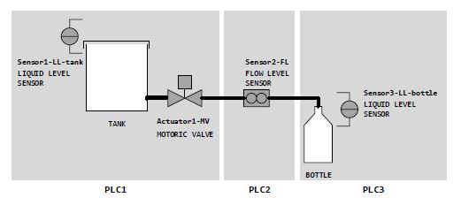
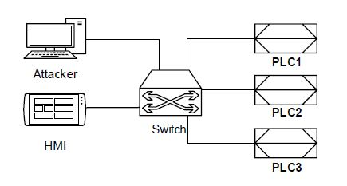

# DigitalTwin part: simulation of a filling-plant
TODO






## Installation
To install the **DigitalTwin** simulation of a filling plant please follow the instructions given below in the exact order.
### Install mininet

```bash
pip install todo
```

### Install MiniCPS
```bash
pip install todo
```

## Usage
Description network capabilities and physical process.
Logs folder.


## Research and Citation
Please consider citing this GitHub repository if you are using our  **DigitalTwin** simulation of the filling plant.
